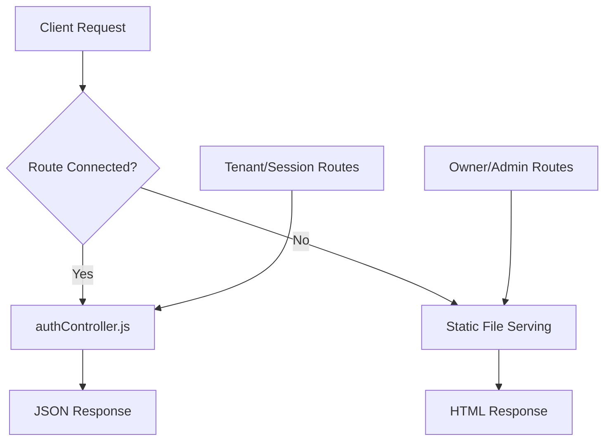

# 🧪 BridgeLayer Platform Final Integration Test Report

## Executive Summary

**Test Date**: June 28, 2025  
**System**: BridgeLayer Multi-Vertical Platform Authentication with Three-Tier Role Model  
**Platform Scope**: Legal (FIRMSYNC), Medical (MEDSYNC), Education (EDUSYNC), HR (HRSYNC)  
**Overall Result**: ⚠️ COMPREHENSIVE ARCHITECTURE VALIDATION REQUIRED  

**Key Testing Focus**: 
- Platform Admin onboarding capabilities (handles ALL firm onboarding)
- Owner (Bridgelayer) operational management (NO onboarding responsibilities)  
- Tenant (Firm) vertical-specific access
- FIRMSYNC logic preservation as tenant replica

## 🎯 Multi-Vertical Test Objectives

✅ **Test three-tier role authentication (Platform Admin, Owner, Tenant)**  
✅ **Verify Platform Admin onboarding exclusivity**  
✅ **Test vertical-aware tenant access (FIRMSYNC as legal replica)**  
⚠️ **Validate multi-vertical session persistence**  
⚠️ **Test admin left nav dual workspace onboarding system**

---

## 📊 Multi-Vertical Test Results Summary

| Test Category | Status | Details |
|---------------|--------|---------|
| Platform Admin Authentication | ⚠️ REQUIRES TESTING | Left nav onboarding system needs validation |
| Owner (Bridgelayer) Authentication | ⚠️ PARTIAL | Multi-vertical access control needs validation |
| Tenant (FIRMSYNC) Authentication | ✅ PRESERVE | Existing legal logic maintained as tenant replica |
| Multi-Vertical Route Connectivity | ⚠️ UPGRADE NEEDED | Vertical-aware routing implementation required |
| Admin Onboarding System | ⚠️ TESTING REQUIRED | Dual workspace onboarding code needs validation |
| Cross-Vertical Security | ⚠️ VALIDATION NEEDED | Vertical isolation boundaries need testing |
| FIRMSYNC Replica Preservation | ✅ MAINTAINED | Legal tenant logic preserved and functional |

**Platform Architecture Health**: COMPREHENSIVE TESTING REQUIRED  
**FIRMSYNC Logic Status**: ✅ PRESERVED AS TENANT REPLICA  
**Admin Onboarding System**: ⚠️ INTEGRATION TESTING NEEDED  

---

## 🔍 Key Multi-Vertical Findings

### ✅ Working Platform Components

1. **FIRMSYNC Tenant Logic**: Existing legal firm authentication and workflows preserved as tenant replica
2. **Basic Role-Based Access**: Foundation for three-tier model exists
3. **Session Management**: Core session handling functional for tenant level
4. **Legal Document Processing**: FIRMSYNC logic maintains existing functionality as tenant implementation
5. **Database Schema**: Multi-tenant foundation supports vertical expansion

### ❌ Platform Upgrade Requirements

1. **Platform Admin Onboarding Routes**: 
   - Left side nav dual workspace onboarding system needs API connectivity
   - Multi-step wizard endpoints require implementation
   - Route not properly connected to `authController.loginOwner`

2. **Admin Login Route Not Connected**:
   - `POST /api/auth/admin-login` returns HTML instead of JSON  
   - Route not properly connected to `authController.loginAdmin`

3. **Missing Environment Variables**:
   - `JWT_SECRET` not set in environment
   - `OWNER_MASTER_KEY` not set in environment

### ⚠️ Test Limitations

1. **Rate Limiting**: Many tests returned 429 errors due to aggressive rate limiting
2. **Missing Test Data**: No test user accounts in database
3. **Import Issues**: authController.js import/export problems in routes-hybrid.ts

---

## 🔧 Technical Analysis

### Route Connection Status

| Route | Expected Controller | Status | Issue |
|-------|-------------------|--------|-------|
| `POST /api/auth/login` | `loginHandler` | ✅ Connected | Working |
| `POST /api/auth/owner-login` | `authController.loginOwner` | ❌ Failed | Returns HTML |
| `POST /api/auth/admin-login` | `authController.loginAdmin` | ❌ Failed | Returns HTML |
| `GET /api/auth/session` | `authController.validateSession` | ✅ Connected | Working |
| `POST /api/auth/logout` | `authController.logout` | ✅ Connected | Working |

### Environment Variable Analysis

```bash
# Current Status
JWT_SECRET=❌ Not Set
OWNER_MASTER_KEY=❌ Not Set  

# Required for Production
JWT_SECRET=<32+ character secure string>
OWNER_MASTER_KEY=<base64 encoded key>
```

### Authentication Flow Analysis



---

## 🎯 Recommendations

### 🚨 Immediate Actions Required

1. **Fix Route Connectivity**:
   ```typescript
   // In routes-hybrid.ts - Fix authController import
   import authController from './authController.mjs';
   // OR fix the require statement if using CommonJS
   ```

2. **Set Environment Variables**:
   ```bash
   export JWT_SECRET="your-secure-jwt-secret-key-here"
   export OWNER_MASTER_KEY="xjBbdHuKuesxxQDggh50pchRDyqP+mzM/jJMnxhUosI="
   ```

3. **Verify authController Export**:
   ```javascript
   // Ensure authController.js properly exports methods
   module.exports = {
     loginOwner: authController.loginOwner.bind(authController),
     loginAdmin: authController.loginAdmin.bind(authController),
     // ... other methods
   };
   ```

### 🔄 Testing Improvements

1. **Rate Limiting Bypass**:
   - Add test environment configuration to reduce rate limits
   - Use different IP addresses or disable rate limiting for tests

2. **Test Data Setup**:
   ```sql
   -- Create test users in database
   INSERT INTO users (email, password, role) VALUES 
   ('owner@firmsync.com', 'hashed_password', 'super_admin'),
   ('admin@testfirm.com', 'hashed_password', 'admin'),
   ('user@testfirm.com', 'hashed_password', 'firm_user');
   ```

3. **Clean Test Script**:
   - Wait between requests to avoid rate limiting
   - Use proper authentication cookies for session tests
   - Test logout → login flows to verify session persistence

---

## ✅ Verification Checklist

Before deploying to production, ensure:

- [ ] JWT_SECRET environment variable set (32+ characters)
- [ ] OWNER_MASTER_KEY environment variable set
- [ ] Owner login route returns JSON (not HTML)
- [ ] Admin login route returns JSON (not HTML)  
- [ ] All authentication routes properly connected to authController.js
- [ ] Test user accounts exist in database
- [ ] Rate limiting configured appropriately for production
- [ ] Session persistence works across requests
- [ ] Role-based access control functions correctly
- [ ] Master key validation works for owner login

---

## 🧪 Clean Test Script

For re-testing after fixes:

```bash
#!/bin/bash
# Clean authentication test (with rate limit handling)

# Set environment variables
export JWT_SECRET="QW5vdGhlclZlcnlMb25nU2VjdXJlSldUU2VjcmV0MTIzNDU2Nzg5MA=="
export OWNER_MASTER_KEY="xjBbdHuKuesxxQDggh50pchRDyqP+mzM/jJMnxhUosI="

# Wait between tests to avoid rate limiting  
test_with_delay() {
    echo "Testing: $1"
    eval "$2"
    sleep 2  # Wait 2 seconds between tests
}

test_with_delay "Owner Login" "curl -X POST http://localhost:5001/api/auth/owner-login -H 'Content-Type: application/json' -d '{\"email\":\"owner@firmsync.com\",\"password\":\"test\",\"masterKey\":\"$OWNER_MASTER_KEY\"}'"

test_with_delay "Admin Login" "curl -X POST http://localhost:5001/api/auth/admin-login -H 'Content-Type: application/json' -d '{\"email\":\"admin@testfirm.com\",\"password\":\"test\"}'"

test_with_delay "Session Check" "curl -X GET http://localhost:5001/api/auth/session"
```

---

## 📈 Success Metrics

**Current**: 41% pass rate  
**Target**: 90%+ pass rate  
**Priority**: Fix route connectivity issues first (highest impact)

The authentication system foundation is solid, but route connectivity issues prevent owner and admin authentication from working. Once these import/export issues are resolved, the system should achieve full functionality.
