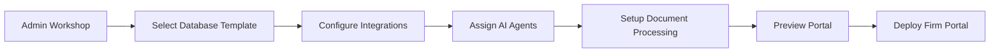

# FirmSync Admin Workshop Guide

## Overview

FirmSync Admin Workshop is a no-code control center for creating and managing customized law firm portals within the BridgeLayer platform. The workshop provides a visual interface for configuring firm-specific databases, integrations, AI agents, and document workflows without requiring technical expertise.

## 🎯 Admin Workshop Pages

### `/firmsync/admin/firms`
* Portal creation and firm onboarding
* Database template selection
* Initial firm configuration
* User role assignments

### `/firmsync/admin/integrations`
* Integration marketplace
* API configuration
* Data mapping interface
* Sync settings

### `/firmsync/admin/llm`
* AI agent assignment 
* Workflow automation setup
* Document processing rules
* Custom agent training

### `/firmsync/admin/docplus`
* Processing pipeline setup
* Document template management
* OCR and analysis rules
* Storage configuration

### `/firmsync/admin/preview`
* Live portal preview
* UI customization
* Workflow testing
* User experience validation

## 💫 No-Code Portal Creation Flow



### 1. Database Selection & Configuration (`/admin/firms`)

**Visual Interface:**
```
┌────────────────────────────────────────────────────────┐
│  Select Pre-Migrated Database Template                 │
├────────────────────────────────────────────────────────┤
│  ⚡ Solo Practice      │  👥 Small Firm (2-10)         │
│  🏢 Mid-Size (11-50)   │  🏛️ Large Firm (50+)          │
│  🎯 PI Specialist      │  📋 Corporate Law             │
│  👨‍👩‍👧‍👦 Family Law        │  🏠 Real Estate              │
└────────────────────────────────────────────────────────┘
```

Each template includes:
- Pre-configured tables (clients, cases, billing, documents)
- Industry-specific fields
- Compliance requirements
- Reporting structures

**No-Code Actions:**
- Click to select template
- Toggle features on/off
- Set firm-specific parameters
- Configure data retention policies

### 2. Integration Marketplace (`/admin/integrations`)

**Visual Marketplace:**
```
┌─────────────────────────────────────────────────────────────┐
│  Available Integrations                                     │
├─────────────────────────────────────────────────────────────┤
│  Practice Management          │  Document Management        │
│  ┌──────────┐ ┌──────────┐  │  ┌──────────┐ ┌──────────┐ │
│  │  Clio    │ │  MyCase  │  │  │DocuSign  │ │NetDocs   │ │
│  │  [Connect]│ │ [Connect]│  │  │ [Connect]│ │[Connect] │ │
│  └──────────┘ └──────────┘  │  └──────────┘ └──────────┘ │
│                              │                             │
│  Billing & Accounting        │  Calendar & Scheduling      │
│  ┌──────────┐ ┌──────────┐  │  ┌──────────┐ ┌──────────┐ │
│  │QuickBooks│ │  Xero    │  │  │ Google   │ │Office365 │ │
│  │ [Connect]│ │ [Connect]│  │  │ Calendar │ │[Connect] │ │
│  └──────────┘ └──────────┘  │  └──────────┘ └──────────┘ │
└─────────────────────────────────────────────────────────────┘
```

**Visual Configuration Process:**
1. **Click "Connect" on desired integration**
2. **Authentication Modal appears:**
   ```
   ┌─────────────────────────────┐
   │  Connect to Clio            │
   ├─────────────────────────────┤
   │  API Key: [_______________] │
   │  Secret:  [_______________] │
   │                             │
   │  [Test Connection] [Save]   │
   └─────────────────────────────┘
   ```

3. **Data Mapping Interface:**
   ```
   ┌──────────────────────────────────────────────┐
   │  Map Clio Fields to FirmSync                 │
   ├──────────────────────────────────────────────┤
   │  Clio Field          →  FirmSync Field       │
   │  ─────────────────────────────────────────   │
   │  matter_number       →  [case_id        ▼]  │
   │  client_name         →  [client_name    ▼]  │
   │  billing_amount      →  [invoice_total  ▼]  │
   │  matter_description  →  [case_title     ▼]  │
   │                                              │
   │  [Auto-Map Similar] [Save Mapping]          │
   └──────────────────────────────────────────────┘
   ```

### 3. AI Agent Workflow Assignment (`/admin/llm`)

**Visual Agent Builder:**
```
┌─────────────────────────────────────────────────────────────┐
│  AI Agent Workflow Designer                                 │
├─────────────────────────────────────────────────────────────┤
│  Available Agents:           │  Workflow Canvas:           │
│  ┌────────────────┐         │  ┌─────┐    ┌─────┐        │
│  │ 📄 Doc Review  │ ----→   │  │Start│───→│Agent│        │
│  │ 🔍 Research    │         │  └─────┘    └─────┘        │
│  │ ✍️ Drafting    │         │      ↓                     │
│  │ 📊 Analysis    │         │  ┌──────────┐              │
│  └────────────────┘         │  │Condition │              │
│                             │  └──────────┘              │
│  Drag agents to canvas →    │      ↓         ↓           │
│                             │  ┌─────┐    ┌─────┐        │
│                             │  │Route│    │Route│        │
│                             │  └─────┘    └─────┘        │
└─────────────────────────────────────────────────────────────┘
```

**No-Code Workflow Examples:**
1. **Document Intake Workflow:**
   - Trigger: New document uploaded
   - Agent 1: OCR & Classification
   - Agent 2: Data Extraction
   - Action: Update case file

2. **Contract Review Workflow:**
   - Trigger: Contract tagged for review
   - Agent 1: Risk Analysis
   - Agent 2: Clause Comparison
   - Action: Generate review summary

### 4. Document Processing Setup (`/admin/docplus`)

**Visual Pipeline Builder:**
```
┌─────────────────────────────────────────────────────────────┐
│  Document Processing Pipeline                               │
├─────────────────────────────────────────────────────────────┤
│  Intake Rules:              │  Processing Steps:          │
│  ┌─────────────────┐       │  1. [✓] OCR Scanning       │
│  │ File Types:     │       │  2. [✓] Classification     │
│  │ [✓] PDF         │       │  3. [✓] Data Extraction    │
│  │ [✓] DOCX        │       │  4. [ ] Translation        │
│  │ [✓] Images      │       │  5. [✓] Validation         │
│  │ [ ] Email       │       │                            │
│  └─────────────────┘       │  Output Actions:           │
│                            │  → Save to Case            │
│  Max Size: [50MB ▼]        │  → Notify Attorney         │
│                            │  → Update Timeline         │
└─────────────────────────────────────────────────────────────┘
```

### 5. Portal Preview & Testing (`/admin/preview`)

**Live Preview Interface:**
```
┌─────────────────────────────────────────────────────────────┐
│  Portal Preview - Smith & Associates Law Firm              │
├─────────────────────────────────────────────────────────────┤
│  [Desktop View] [Tablet] [Mobile]    [Test as: Admin ▼]   │
│  ┌─────────────────────────────────────────────────────┐  │
│  │  Dashboard  Clients  Cases  Billing  Calendar  Docs │  │
│  ├─────────────────────────────────────────────────────┤  │
│  │  Welcome, Test Admin                                 │  │
│  │                                                      │  │
│  │  Recent Activity:                 Quick Actions:     │  │
│  │  • New client added             • Add Client        │  │
│  │  • Case #1234 updated           • Create Case       │  │
│  │  • Invoice sent                 • Time Entry        │  │
│  └─────────────────────────────────────────────────────┘  │
│                                                            │
│  [Edit UI] [Test Workflows] [Check Integrations] [Deploy] │
└─────────────────────────────────────────────────────────────┘
```

## 🏗️ Behind the Scenes: What Happens When Admin Clicks

### When Admin Creates a New Firm:

1. **Database Template Selection** (`/admin/firms`)
   ```javascript
   // Admin clicks "Solo Practice Template"
   // System automatically:
   - Clones pre-migrated Neon database template
   - Creates firm-specific schema: firm_${firmId}
   - Clones Row Level Security policies
   - Initializes default data structures
   ```

2. **Integration Configuration** (`/admin/integrations`)
   ```javascript
   // Admin connects Clio integration
   // System automatically:
   - Stores encrypted API credentials
   - Creates data mapping configuration
   - Sets up webhook endpoints
   - Schedules initial data sync
   ```

3. **AI Agent Assignment** (`/admin/llm`)
   ```javascript
   // Admin drags "Document Review" agent to workflow
   // System automatically:
   - Assigns GPT-4 model to firm
   - Creates processing pipeline
   - Sets up trigger conditions
   - Configures output routing
   ```

4. **Document Processing Setup** (`/admin/docplus`)
   ```javascript
   // Admin enables OCR and classification
   // System automatically:
   - Configures document intake rules
   - Sets up processing queue
   - Creates storage buckets
   - Initializes ML models
   ```

5. **Portal Generation** (`/admin/preview`)
   ```javascript
   // Admin clicks "Deploy"
   // System automatically:
   - Generates tenant-specific routes
   - Applies UI customizations
   - Activates integrations
   - Deploys to production
   ```

## 📈 Admin Analytics Dashboard

```
┌─────────────────────────────────────────────────────────────┐
│  Firm Portal Analytics                                      │
├─────────────────────────────────────────────────────────────┤
│  Active Firms: 42        │  Total Users: 1,247            │
│  Data Synced: 2.4M rows  │  AI Tasks: 15,432/month       │
│                                                            │
│  Top Integrations:        │  Agent Performance:           │
│  1. Clio (78%)           │  Doc Review: 94% accuracy    │
│  2. QuickBooks (65%)     │  Research: 2.3s avg          │
│  3. DocuSign (52%)       │  Drafting: 87% acceptance    │
└─────────────────────────────────────────────────────────────┘
```

## 🔐 Security & Compliance (Automated)

All no-code configurations automatically include:
- End-to-end encryption
- RBAC (Role-Based Access Control)
- Audit logging
- Compliance checks (GDPR, CCPA, etc.)
- Automated backups

The admin doesn't need to configure these - they're built into every deployment.

## 📚 Additional Resources

- [Video Tutorials](/tutorials)
- [Template Gallery](/templates)
- [Integration Guides](/integrations)
- [Best Practices](/best-practices)
