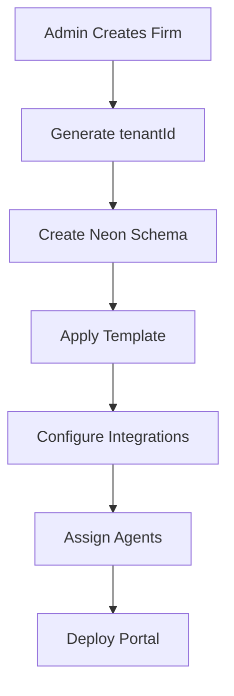
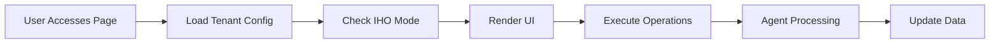
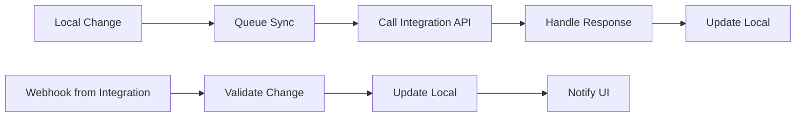

# FirmSync Tenant Portal Technical Specification

## Overview

The FirmSync Tenant Portal (`/firmsync/[tenantId]/`) is a dynamically generated law firm management system that renders based on Admin Workshop configurations. Each tenant portal is a fully isolated, customized instance with its own database schema, integrations, AI agents, and UI preferences.

## 🏗️ Portal Architecture

### URL Structure
```
https://app.firmsync.com/firmsync/[tenantId]/[page]
```

- **tenantId**: Unique identifier (e.g., `smith-law`, `johnson-associates`)
- **page**: One of 12 predefined pages (9 standard + 3 wildcards)

### Fixed Layout Structure

```
┌─────────────────────────────────────────────────────────────────┐
│  [Firm Logo]  FirmSync Portal - [Firm Name]           [User ▼] │
├─────────────────────────────────────────────────────────────────┤
│  Dashboard │ Clients │ Cases │ Calendar │ Billing │ DocSign │  │
│  Paralegal+ │ Reports │ Settings │ [Wild1] │ [Wild2] │ [Wild3] │
├─────────────────────────────────────────────────────────────────┤
│                                                                 │
│                    [Page Content Area]                          │
│                                                                 │
└─────────────────────────────────────────────────────────────────┘
```

**Layout Lock**: The 12-tab structure is permanent and cannot be modified by tenants.

## 📑 Page Specifications

### 1. Dashboard (`/[tenantId]/dashboard`)
**Purpose**: Overview and quick actions
**IHO Operations**: `getDashboardMetrics`, `getRecentActivity`, `getSystemAlerts`
**Agent**: Analytics Agent - Aggregates data across all modules
**UI Elements**:
- KPI cards (Active Cases, Revenue, Client Count, Deadlines)
- Recent activity feed
- Quick action buttons
- Mini calendar widget

### 2. Clients (`/[tenantId]/clients`)
**Purpose**: Client relationship management
**IHO Operations**: `add`, `view`, `edit`, `contact`
**Agent**: Client Intelligence Agent - Enriches client profiles
**UI Elements**:
- Client data table with search/filter
- Add/Edit client modal
- Contact history
- Related cases viewer

### 3. Cases (`/[tenantId]/cases`)
**Purpose**: Matter and case management
**IHO Operations**: `add`, `view`, `edit`, `status`, `delete`
**Agent**: Case Management Agent - Tracks deadlines and milestones
**UI Elements**:
- Case list with status indicators
- Kanban board view option
- Case detail pages
- Document attachments
- Timeline/activity log

### 4. Calendar (`/[tenantId]/calendar`)
**Purpose**: Scheduling and appointments
**IHO Operations**: `events`, `create_event`, `update_event`, `delete_event`
**Agent**: Scheduling Agent - Conflict detection and reminders
**UI Elements**:
- Month/Week/Day views
- Event creation modal
- Color-coded event types
- Availability checker

### 5. Billing (`/[tenantId]/billing`)
**Purpose**: Time tracking and invoicing
**IHO Operations**: `invoices`, `create_invoice`, `record_payment`, `track_time`
**Agent**: Billing Agent - Automated time capture and invoice generation
**UI Elements**:
- Invoice list and creation
- Time entry form
- Payment tracking
- Financial reports

### 6. DocSign (`/[tenantId]/docsign`)
**Purpose**: Document signing workflow
**IHO Operations**: `upload`, `send_for_signature`, `track_status`, `download`
**Agent**: Document Agent - Template management and routing
**UI Elements**:
- Document upload area
- Signature request form
- Status tracker
- Completed documents vault

### 7. Paralegal+ (`/[tenantId]/paralegal-plus`)
**Purpose**: AI-powered legal assistance
**Special**: NATIVE ONLY - No integration mode
**Agent**: Legal AI Agent - Research, drafting, analysis
**UI Elements** (4 Required Tabs):
```
┌─────────────────────────────────────────────────────┐
│  Research │ Drafting │ Analysis │ Document Review  │
├─────────────────────────────────────────────────────┤
│                                                     │
│  [Tab-specific content area]                        │
│                                                     │
└─────────────────────────────────────────────────────┘
```

### 8. Reports (`/[tenantId]/reports`)
**Purpose**: Analytics and reporting
**IHO Operations**: `generate_report`, `get_reports`, `export_report`
**Agent**: Reporting Agent - Data aggregation and visualization
**UI Elements**:
- Report type selector
- Date range picker
- Generated reports list
- Export options (PDF, CSV, Excel)

### 9. Settings (`/[tenantId]/settings`)
**Purpose**: Tenant-specific configuration
**IHO Operations**: `get_settings`, `update_settings`, `manage_users`
**Agent**: Configuration Agent - Settings sync and validation
**UI Elements**:
- Firm profile
- User management
- Billing preferences
- Integration status
- Notification settings

### 10-12. Wildcard Pages (`/[tenantId]/wildcards/[1-3]`)
**Purpose**: Custom third-party tool embedding
**Configuration**: Set by admin in workshop
**Examples**:
- Wildcard 1: "Court Calendar" → Embedded court system
- Wildcard 2: "Research" → Westlaw iframe
- Wildcard 3: "Accounting" → QuickBooks embedded

**Implementation**:
```typescript
// Wildcard configuration stored in tenant settings
{
  wildcards: {
    1: {
      label: "Court Calendar",
      url: "https://courtcal.com/embed",
      icon: "calendar-check",
      auth: "oauth",
      permissions: ["tenant_admin", "tenant_user"]
    }
  }
}
```

## 🔄 IHO (In-Host-Out) Framework

### Data Flow Architecture

```
┌─────────────┐     ┌─────────────┐     ┌─────────────┐
│   UI Page   │ ←→  │  API Route  │ ←→  │ IHO Manager │
└─────────────┘     └─────────────┘     └─────────────┘
                                               ↓
                                         ┌─────────────┐
                                         │ Mode Check  │
                                         └─────────────┘
                                           ↙         ↘
                                   Native          Integration
                                      ↓                 ↓
                              ┌─────────────┐   ┌─────────────┐
                              │  Neon DB    │   │External API │
                              │ (firm_123)  │   │   (Clio)    │
                              └─────────────┘   └─────────────┘
```

### Mode Configuration by Page

Each page can operate in one of three modes:

1. **Native Only**: Data stored and managed in Neon DB
2. **Integration Only**: Data managed by external system
3. **Hybrid**: Data synced between Neon and external system

**Admin Configuration Example**:
```javascript
// Stored in tenant.settings.iho_config
{
  clients: {
    mode: "hybrid",
    integration: "clio",
    sync_frequency: "15min",
    conflict_resolution: "integration_wins"
  },
  calendar: {
    mode: "integration",
    integration: "google_calendar",
    sync_frequency: "realtime"
  },
  billing: {
    mode: "native",
    integration: null
  }
}
```

## 🗄️ Database Architecture

### Per-Tenant Schema Isolation

Each tenant gets an isolated Neon database schema:

```sql
-- Schema naming: firm_[tenantId]
CREATE SCHEMA firm_123;

-- All tenant tables live in their schema
CREATE TABLE firm_123.clients (
  id SERIAL PRIMARY KEY,
  name TEXT NOT NULL,
  email TEXT,
  phone TEXT,
  created_at TIMESTAMPTZ DEFAULT NOW()
);

CREATE TABLE firm_123.cases (
  id SERIAL PRIMARY KEY,
  client_id INTEGER REFERENCES firm_123.clients(id),
  title TEXT NOT NULL,
  status TEXT,
  created_at TIMESTAMPTZ DEFAULT NOW()
);

-- Continue for all domain tables...
```

### Row-Level Security

```sql
-- Ensure tenant isolation
CREATE POLICY tenant_isolation ON firm_123.clients
  FOR ALL USING (
    current_setting('app.tenant_id')::INTEGER = 123
  );
```

## 🤖 Agent Mapping System

### Page-to-Agent Assignment

Each page has a dedicated AI agent configured by the admin:

```javascript
// Agent configuration stored in tenant.settings.agents
{
  dashboard: {
    agent: "analytics-agent-v2",
    model: "gpt-4",
    capabilities: ["summarize", "forecast", "alert"]
  },
  clients: {
    agent: "client-intel-agent",
    model: "gpt-3.5-turbo",
    capabilities: ["enrich", "deduplicate", "score"]
  },
  cases: {
    agent: "case-management-agent",
    model: "gpt-4",
    capabilities: ["deadline-tracking", "milestone-prediction"]
  },
  // ... other pages
}
```

### Agent Workflow Examples

**Client Intelligence Agent**:
```
Trigger: New client added
Actions:
1. Search public records for additional info
2. Check for conflicts of interest
3. Calculate client value score
4. Suggest related services
```

**Case Management Agent**:
```
Trigger: Case status updated
Actions:
1. Update timeline predictions
2. Check for deadline impacts
3. Notify relevant team members
4. Suggest next actions
```

## 🎨 UI Rendering Based on Configuration

### Dynamic UI Elements

The UI adapts based on admin configurations:

```typescript
// Example: Clients page renders differently based on mode
function ClientsPage({ tenantId }) {
  const config = await getIHOConfig(tenantId, 'clients');
  
  if (config.mode === 'native') {
    return <NativeClientUI />;  // Full CRUD interface
  } else if (config.mode === 'integration') {
    return <IntegrationClientUI integration={config.integration} />; // Read-only with sync status
  } else {
    return <HybridClientUI />; // CRUD with sync indicators
  }
}
```

### Integration-Specific UI Features

**Native Mode**:
- Full CRUD operations
- Custom fields
- Direct database queries
- Instant updates

**Integration Mode**:
- Sync status indicators
- "Open in [Integration]" buttons
- Limited editing (based on API capabilities)
- Refresh/sync buttons

**Hybrid Mode**:
- Conflict resolution UI
- Sync history
- Field mapping indicators
- Manual sync triggers

## 🔧 Integration Rendering Effects

### How Integrations Change the Portal

1. **Navigation Badges**:
   ```
   Clients (Synced with Clio) 🔄
   Calendar (Google Calendar) 🔗
   ```

2. **Page Headers**:
   ```
   ┌────────────────────────────────────────┐
   │ Clients │ Connected to: Clio          │
   │         │ Last sync: 2 min ago    [↻] │
   └────────────────────────────────────────┘
   ```

3. **Action Buttons**:
   - Native: "Add Client" → Direct database insert
   - Integration: "Add Client" → Opens Clio in modal or redirects
   - Hybrid: "Add Client" → Local insert + queue for sync

4. **Data Freshness Indicators**:
   ```
   Client Name (Updated in Clio 5 min ago) ⚠️
   ```

## 📊 Tenant Portal Lifecycle

### 1. Initial Provisioning


### 2. Runtime Operation


### 3. Data Synchronization (Hybrid Mode)


## 🔐 Security & Access Control

### Tenant Isolation
- URL-based tenant identification
- JWT includes tenant_id claim
- Database schema isolation
- API route tenant validation

### Permission Levels
```typescript
// Permissions checked at multiple levels
const permissions = {
  tenant_admin: [
    'manage_users',
    'configure_integrations',
    'view_all_data',
    'export_data'
  ],
  tenant_user: [
    'view_assigned_data',
    'create_entries',
    'edit_own_entries'
  ]
};
```

## 🚀 Performance Optimizations

### Caching Strategy
- Tenant config cached for 5 minutes
- Integration status cached for 1 minute
- Static resources CDN cached
- Database query results cached based on mode

### Loading States
```typescript
// Progressive loading for better UX
<PageLayout>
  <Suspense fallback={<SkeletonLoader />}>
    <ClientsList />
  </Suspense>
</PageLayout>
```

## 📋 Admin Workshop → Tenant Portal Mapping

### What Admin Configures → What Tenant Sees

| Admin Workshop Setting | Tenant Portal Result |
|------------------------|---------------------|
| Select "Clio" for Clients | Clients page shows Clio sync status |
| Enable "Document Review" agent | Paralegal+ tab has document analysis |
| Set Wildcard 1 = "Court Cal" | New tab appears with court calendar |
| Choose "Hybrid" for Calendar | Calendar shows both local and Google events |
| Configure invoice template | Billing page uses custom invoice layout |

## 🛠️ Development Guidelines

### Adding New Features
1. Features must work in all three modes (Native/Integration/Hybrid)
2. UI must gracefully handle sync states
3. Agents must be page-specific
4. Database operations must respect tenant schema

### Testing Checklist
- [ ] Test with multiple tenant configurations
- [ ] Verify integration failover to native
- [ ] Check agent processing queues
- [ ] Validate tenant isolation
- [ ] Test wildcard iframe security

## 📚 API Endpoints

### Standard Pattern
```
GET    /api/firmsync/[tenantId]/[page]          # List/View
POST   /api/firmsync/[tenantId]/[page]          # Create
PUT    /api/firmsync/[tenantId]/[page]/[id]     # Update
DELETE /api/firmsync/[tenantId]/[page]/[id]     # Delete
PATCH  /api/firmsync/[tenantId]/[page]/[action] # Special actions
```

### IHO Mode Response
```typescript
// API responses include mode information
{
  data: [...],
  meta: {
    mode: "hybrid",
    integration: "clio",
    last_sync: "2024-01-10T10:30:00Z",
    sync_status: "healthy"
  }
}
```

---

*This specification defines the complete technical requirements for FirmSync tenant portals. The 12-tab layout is fixed, but the functionality within each tab is highly configurable through the Admin Workshop's no-code interface.*