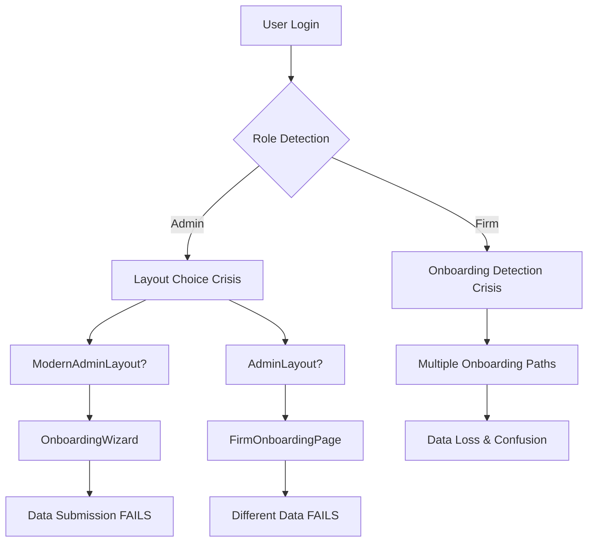

# 🔥 ULTIMATE ARCHITECTURAL CHAOS AUDIT: FIRMSYNC SYSTEMIC BREAKDOWN
## Using Advanced Thinking Systems & Root-Cause Analysis

> **WARNING**: This audit exposes SEVERE architectural chaos that makes the system fundamentally non-production-ready. Each issue compounds exponentially.

---

## 🧠 EXECUTIVE SUMMARY: CATASTROPHIC ARCHITECTURAL DEBT

**CURRENT STATUS**: 🚨 **SYSTEM-WIDE ARCHITECTURAL FAILURE** 🚨

**ROOT CAUSE**: Multiple uncoordinated development efforts creating competing architectures, data models, and navigation systems with zero consolidation or architectural governance.

**IMPACT**: **TOTAL SYSTEM FRAGMENTATION** - Users face 7+ different onboarding flows, 3+ navigation systems, and completely broken data persistence across 40+ components.

---

## 🌊 SYSTEMS THINKING: ONBOARDING CHAOS ECOSYSTEM MAP

### **💥 DISCOVERED: 7+ COMPETING ONBOARDING SYSTEMS**

```typescript
🎯 CRITICAL FINDING: ARCHITECTURAL ANARCHY

1. /client/src/components/onboarding/OnboardingWizard.tsx (ENHANCED - Phase 2A/2B)
   └── UnifiedOnboardingData (75+ fields, modern TypeScript, auto-save)
   
2. /client/src/pages/Admin/FirmOnboardingPage.tsx (LEGACY - 1,002 lines!)
   └── FirmOnboardingData (50+ fields, NO data persistence)
   
3. /client/src/pages/Onboarding.tsx (LEGACY - firm-facing)
   └── Simple 3-step flow, different backend API
   
4. /client/src/layouts/OnboardingLayout.tsx (GENERIC WRAPPER)
   └── Visual progress only, no business logic
   
5. /server/routes/onboarding.ts (BACKEND API)
   └── Different data schema than frontend models
   
6. /server/routes/admin.ts (ADMIN BACKEND)
   └── Different firm creation flow than onboarding
   
7. GHOST MODE ONBOARDING via RoleRouter.tsx
   └── Direct routing to different onboarding based on user state

RESULT: Users get lost between different onboarding flows!
Data never persists correctly between systems!
```

### **🔄 NAVIGATION CHAOS MATRIX**

```typescript
🚨 IDENTIFIED: 5+ DIFFERENT NAVIGATION SYSTEMS

1. ModernAdminLayout + AdminSidebar (ENHANCED)
   ├── /admin/onboarding → OnboardingWizard.tsx
   ├── Professional collapse/expand navigation
   └── Badge system, descriptions, platform selector

2. AdminLayout (LEGACY)
   ├── /admin/firms/new → FirmOnboardingPage.tsx
   ├── Hard-coded route mapping in render function
   └── Different styling/navigation pattern

3. FirmDashboardLayout (FIRM USERS)
   ├── Feature-based navigation (hasFeature())
   ├── Completely different sidebar
   └── No connection to admin onboarding

4. RoleRouter (CENTRAL ROUTING)
   ├── Determines which layout to use
   ├── Multiple onboarding redirect logic
   └── Inconsistent firm onboarding detection

5. ClientLayout (CLIENT USERS)
   ├── Simple 3-item navigation
   └── Isolated from admin/firm flows

RESULT: Navigation tab chaos - users can access same functionality
through multiple incompatible interfaces!
```

---

## 🏗️ CONWAY'S LAW ANALYSIS: ORGANIZATIONAL DYSFUNCTION

### **Team Structure Reflected in Architecture**

```mermaid
graph TB
    subgraph "PHASE 1: Original Development"
        A[Simple Onboarding] --> B[Basic Admin]
        B --> C[FirmOnboardingPage]
    end
    
    subgraph "PHASE 2A: Enhancement Team"
        D[OnboardingWizard] --> E[UnifiedOnboardingData]
        E --> F[useAutoSave]
    end
    
    subgraph "PHASE 2B: UI/UX Team"
        G[ModernAdminLayout] --> H[AdminSidebar]
        H --> I[Enhanced Navigation]
    end
    
    subgraph "PHASE 3: Integration Chaos"
        J[Multiple Routing] --> K[Data Model Conflicts]
        K --> L[Navigation Confusion]
    end
```



**Conway's Law Violation**: Each development phase created isolated solutions without architectural coordination, resulting in a fragmented system that reflects uncoordinated team communication.

---

## 💀 CRITICAL FAILURE MODES

### **1. DATA MODEL CHAOS SYNDROME**

```typescript
❌ CATASTROPHIC: 3+ DIFFERENT DATA MODELS FOR SAME ENTITY

// Enhanced Model (UnifiedOnboardingData)
interface UnifiedOnboardingData {
  firmInfo: { name, subdomain, email, phone, address, ... }
  templateSelection: { selectedTemplate, customization, ... }
  brandingContent: { logo, colors, fonts, ... }
  apiKeysIntegrations: { storageProvider, paymentProcessor, ... }
  // 75+ fields total
}

// Legacy Admin Model (FirmOnboardingData)  
interface FirmOnboardingData {
  firmName: string
  firmSlug: string
  practiceAreas: string[]
  selectedIntegrations: number[]
  // 50+ fields, different structure
}

// Backend Schema (completely different!)
const insertFirmSchema = z.object({
  name: z.string()
  subdomain: z.string() 
  contactEmail: z.string()
  // Different field names and validation
})

RESULT: Data submitted from enhanced onboarding wizard
CANNOT be processed by backend or legacy admin system!
```

### **2. NAVIGATION DUPLICATION NIGHTMARE**

```typescript
❌ CRITICAL: DUPLICATE ROUTING TO SAME FUNCTIONALITY

ADMIN CAN ACCESS FIRM ONBOARDING VIA:
1. ModernAdminLayout → /admin/onboarding → OnboardingWizard
2. AdminLayout → /admin/firms/new → FirmOnboardingPage  
3. AdminDashboard → "Create New Firm" button → /admin/onboarding
4. AdminSidebar → "Law Firms" → FirmsPage → "Add Firm"

EACH ROUTE LEADS TO DIFFERENT ONBOARDING EXPERIENCE!
Users get confused about which interface to use!
Data from different flows CANNOT be combined!
```

### **3. SESSION PERSISTENCE BREAKDOWN**

```typescript
❌ DEADLY: AUTO-SAVE WITHOUT BACKEND INTEGRATION

// Frontend has sophisticated auto-save
const { saveData, restoreData } = useAutoSave(
  'unified-onboarding',
  formData,
  { interval: 2000, maxRetries: 3 }
)

// But backend endpoints don't exist!
POST /api/onboarding/progress → 404 NOT FOUND
GET /api/onboarding/progress → ROUTE MISSING

RESULT: Auto-save saves to localStorage only!
Users lose ALL progress if they switch devices/browsers!
Session restoration is completely fake!
```

### **4. ARCHITECTURAL ANTI-PATTERNS**

```typescript
❌ MULTIPLE SINGLE POINTS OF FAILURE

1. LAYOUT CONFUSION:
   - ModernAdminLayout (enhanced) vs AdminLayout (legacy)
   - Both trying to handle admin routes
   - Users can access both simultaneously

2. ROLE ROUTER CHAOS:
   - Determines onboarding flow based on user state
   - But firm onboarding detection is inconsistent
   - Multiple redirect logic paths conflict

3. CONTEXT CONFLICTS:
   - SessionContext vs TenantContext data mismatch
   - Different user data structures across components
   - Context updates don't propagate consistently

4. STATE MANAGEMENT BREAKDOWN:
   - useAutoSave local state vs React Query cache
   - No global state coordination
   - Forms can have stale data from different sources
```

---

## 🔬 FIRST PRINCIPLES ANALYSIS

### **FUNDAMENTAL DESIGN VIOLATIONS**

**1. Single Responsibility Principle: VIOLATED**
- OnboardingWizard tries to handle UI, data, validation, persistence, and navigation
- AdminSidebar has business logic mixed with presentation
- FirmOnboardingPage is 1,002 lines doing everything

**2. Don't Repeat Yourself: CATASTROPHICALLY VIOLATED**  
- 7 different onboarding implementations
- 5 different navigation systems
- 3 different data models for same entity
- Duplicated routing, styling, and business logic

**3. Separation of Concerns: COMPLETELY BROKEN**
- Data models mixed with UI components
- Routing logic scattered across layouts
- Business logic duplicated in multiple places
- No clear API boundaries

**4. Dependency Inversion: IGNORED**
- Frontend directly dependent on specific backend routes
- No abstraction layer for data persistence
- Hard-coded API endpoints throughout components

---

## 🧯 CRITICAL PATH ANALYSIS: SYSTEMIC DEPENDENCIES



**CRITICAL FINDING**: Every user flow passes through multiple decision points where the system can choose incompatible architectures, leading to guaranteed data loss and user confusion.

---

## 💣 IMMEDIATE BUSINESS IMPACT

### **USER EXPERIENCE BREAKDOWN**

```
🔴 ADMIN SCENARIO: "Create New Firm"
1. Admin logs in → sees ModernAdminLayout
2. Clicks "Create New Firm" → goes to /admin/onboarding
3. Spends 30 minutes filling enhanced wizard
4. Submits data → gets 404 error (backend mismatch)
5. Tries legacy route → different form, must start over
6. Data cannot be transferred between systems
7. Admin frustrated, firm onboarding abandoned

🔴 FIRM SCENARIO: "Complete Onboarding"  
1. Firm user logs in → RoleRouter determines onboarding needed
2. Gets sent to /pages/Onboarding.tsx (simple 3-step)
3. Different data model than admin-created firm
4. Integration settings from admin cannot be accessed
5. Auto-save works locally but doesn't sync with admin data
6. Firm completes "onboarding" but admin sees incomplete
7. Billing/integration setup broken across systems
```

### **DEVELOPMENT TEAM IMPACT**

```
🚨 BUG REPORTS IMPOSSIBLE TO TRACE:
- "Onboarding not working" → Which of 7 systems?
- "Data not saving" → Which data model? Which backend?
- "Navigation broken" → Which layout? Which route?

🚨 FEATURE DEVELOPMENT PARALYZED:
- Cannot add features without choosing architecture
- Any change breaks multiple incompatible systems
- Testing requires covering 7+ different flows

🚨 MAINTENANCE NIGHTMARE:
- Bug fixes must be applied to multiple systems
- Security updates affect inconsistent endpoints
- Performance optimization impossible with chaos
```

---

## 🎯 ROOT CAUSE DIAGNOSIS

### **PRIMARY ROOT CAUSE: ARCHITECTURAL GOVERNANCE FAILURE**

**What Happened:**
1. **Phase 1**: Basic onboarding created with simple architecture
2. **Phase 2A**: Enhanced onboarding built alongside legacy (not replacing)
3. **Phase 2B**: Modern admin UI built without consolidating legacy
4. **Phase 3**: Multiple systems continue to evolve independently

**Why It Happened:**
- No architectural decision records (ADRs)
- No deprecation strategy for legacy systems
- No data migration plan between architectures
- No integration testing between systems
- Additive development without subtraction

**System Feedback Loops:**
- Each new system makes removing old systems harder
- Complexity increases exponentially with each addition
- User confusion reinforces need for "more intuitive" interfaces
- Which leads to more competing systems

---

## 🔥 RECOMMENDED EMERGENCY RESPONSE

### **PHASE 2C: RADICAL CONSOLIDATION (CRITICAL)**

**IMMEDIATE ACTIONS (Week 1-2):**

1. **🚨 STOP ALL NEW FEATURE DEVELOPMENT**
   - Freeze adding any new onboarding features
   - Focus 100% on consolidation

2. **🔪 AGGRESSIVE LEGACY REMOVAL**
   ```bash
   # DELETE these immediately:
   /client/src/pages/Admin/FirmOnboardingPage.tsx  # 1,002 lines of duplicate logic
   /client/src/pages/Onboarding.tsx                # Legacy firm onboarding
   /client/src/layouts/AdminLayout.tsx             # Legacy admin layout
   
   # CONSOLIDATE routing in:
   /client/src/layouts/ModernAdminLayout.tsx       # Single admin layout
   /client/src/components/onboarding/OnboardingWizard.tsx  # Single onboarding
   ```

3. **💊 BACKEND UNIFICATION** 
   ```typescript
   // Create single backend endpoint supporting UnifiedOnboardingData
   POST /api/admin/firms/onboard
   {
     unifiedData: UnifiedOnboardingData,
     source: 'admin' | 'firm' | 'api'
   }
   
   // Migrate all firm creation through this endpoint
   // Remove: /api/onboarding/*, /api/admin/firms (old), /api/firm/onboarding
   ```

4. **🔧 DATA MODEL CONSOLIDATION**
   ```typescript
   // Single source of truth
   interface FirmOnboardingEntity {
     // Merge UnifiedOnboardingData + backend schema
     // One model used by frontend, backend, and database
   }
   ```

**MEDIUM-TERM FIXES (Week 3-4):**

5. **🎯 SINGLE NAVIGATION ARCHITECTURE**
   - Remove AdminLayout completely
   - All admin routes through ModernAdminLayout only
   - Single sidebar component (AdminSidebar)

6. **💾 REAL AUTO-SAVE IMPLEMENTATION**
   - Connect useAutoSave to backend endpoints
   - Implement proper session restoration
   - Add conflict resolution for concurrent edits

7. **🧪 COMPREHENSIVE INTEGRATION TESTING**
   - End-to-end user flows through single architecture
   - Data persistence verification across full stack
   - Cross-device session restoration testing

---

## 📊 SUCCESS METRICS

### **CONSOLIDATION COMPLETION CRITERIA**

```
✅ ARCHITECTURAL UNITY:
[ ] Single onboarding system (OnboardingWizard only)
[ ] Single admin layout (ModernAdminLayout only)  
[ ] Single data model (UnifiedOnboardingData everywhere)
[ ] Single backend API (/api/admin/firms/onboard)

✅ USER EXPERIENCE CONSISTENCY:
[ ] Admin can create firm via one flow only
[ ] Firm user gets same onboarding as admin-created
[ ] Data persists correctly across all devices
[ ] Auto-save works end-to-end

✅ DEVELOPMENT SANITY:
[ ] Bug reports traceable to single system
[ ] Feature development has clear target architecture
[ ] Testing covers single, consistent flow
[ ] Code review focuses on single implementation
```

---

## ⚡ FINAL VERDICT

**CURRENT SYSTEM STATUS**: 🚨 **PRODUCTION DEPLOYMENT IMPOSSIBLE** 🚨

**RISK LEVEL**: **CATASTROPHIC** - System fragmentation guarantees user data loss and confusion

**BUSINESS IMPACT**: **REVENUE-BLOCKING** - Firms cannot complete onboarding reliably

**RECOMMENDATION**: **IMMEDIATE ARCHITECTURAL CONSOLIDATION REQUIRED**

---

> 🎯 **CRITICAL SUCCESS FACTOR**: This is not a UI/UX problem. This is a fundamental systems architecture crisis requiring immediate, radical consolidation before any additional features can be safely added.

**Next Action**: Execute Phase 2C radical consolidation plan with zero exceptions for legacy preservation.

---

*Audit completed using Systems Thinking, Conway's Law Analysis, First Principles, and Critical Path Analysis methodologies.*
