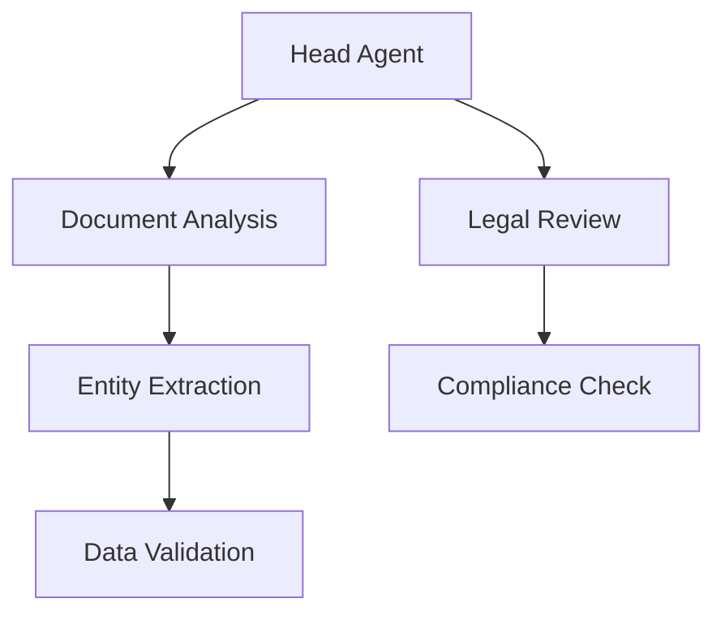

# AI Agents System Overview

## System Components

### Agent Chain Architecture

## Validation System

### Circular Dependency Prevention
- Runtime validation
- Static analysis
- UI warnings
- Chain visualization

### Implementation Status
- [ ] Circular dependency detection
- [ ] UI visualization
- [ ] Runtime checks
- [ ] Error handling

## Prompt Management

### Version Control
- Historical tracking
- Rollback capability
- A/B testing
- Performance metrics

### Implementation Status
- [ ] Version tracking
- [ ] Rollback system
- [ ] Testing framework
- [ ] UI controls

## Integration Points

### External Systems
- OpenAI API
- Document processors
- Knowledge bases
- Training data

### Health Monitoring
- [ ] API status checks
- [ ] Performance metrics
- [ ] Error tracking
- [ ] Alert system
