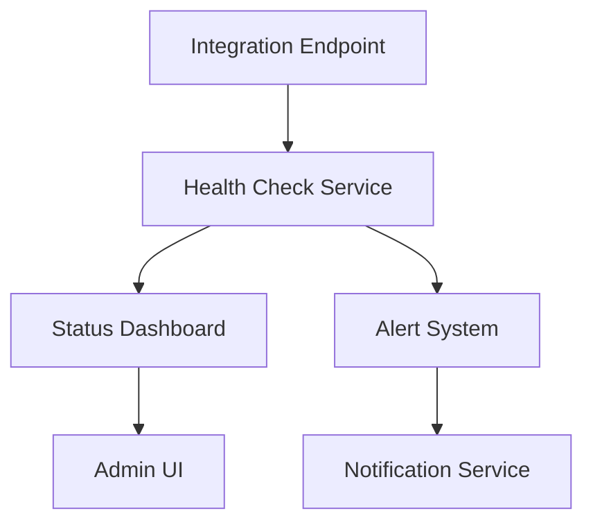

# Integration Health Monitoring System

## Overview

## Health Check Implementation

### Core Components
- Endpoint monitoring
- Response validation
- Latency tracking
- Error logging

### Status Indicators
- 🟢 Healthy (< 100ms)
- 🟡 Degraded (100-500ms)
- 🔴 Failed (> 500ms or error)

## Monitoring Dashboard

### Features
- Real-time status
- Historical metrics
- Error tracking
- Performance graphs

### Implementation Status
- [ ] Status indicators
- [ ] Real-time updates
- [ ] Historical data
- [ ] Alert system

## Alert System

### Configuration
- Threshold settings
- Notification rules
- Escalation paths
- Recovery actions

### Implementation Status
- [ ] Alert triggers
- [ ] Notification system
- [ ] Dashboard integration
- [ ] Documentation
