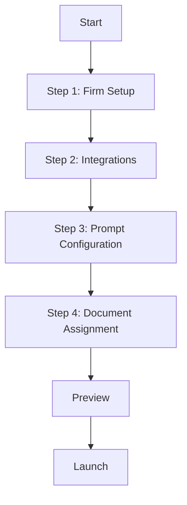

# Onboarding System

## Workflow Overview

## Implementation Status

### Completed
✅ Basic firm setup
✅ Integration selection
✅ Document mapping
✅ Preview system

### In Progress
🚧 AI agent validation
🚧 Health monitoring
🚧 Real-time updates
🚧 User documentation

### Pending
📋 Training materials
📋 Error recovery
📋 Performance metrics
📋 Audit logging

## Validation Rules

### Firm Setup
- Required fields
- Data format
- Duplicate detection

### Integration Setup
- API validation
- Credential check
- Health monitoring

### AI Configuration
- Dependency check
- Resource limits
- Security rules

## Testing Requirements

### Unit Tests
- Data validation
- Error handling
- State management

### Integration Tests
- API connectivity
- Data flow
- Error scenarios

### E2E Tests
- Complete flow
- Edge cases
- Performance
